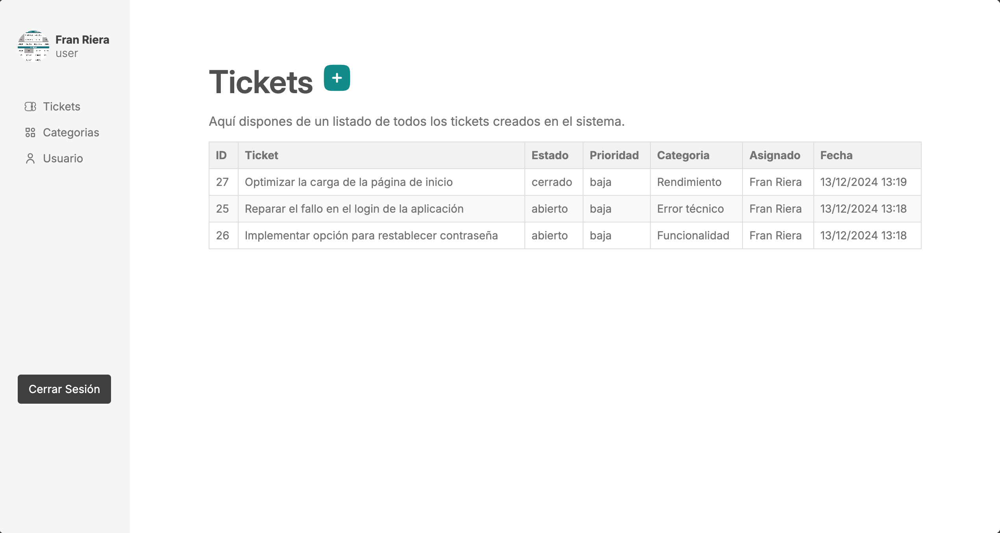
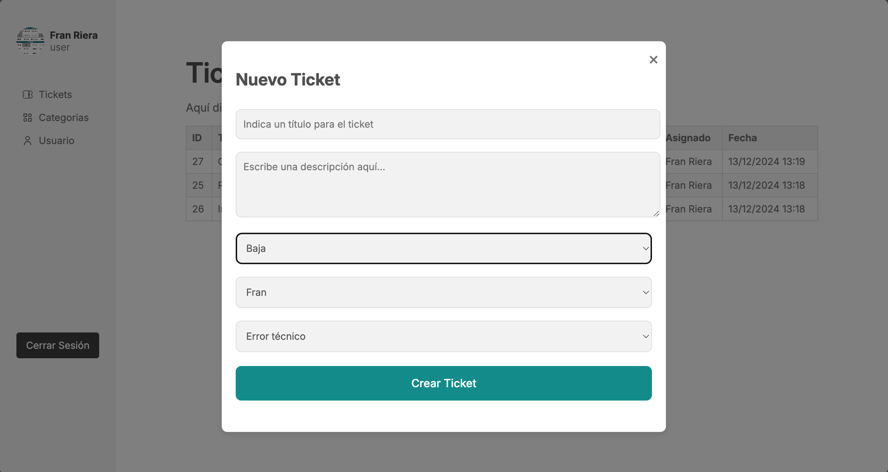
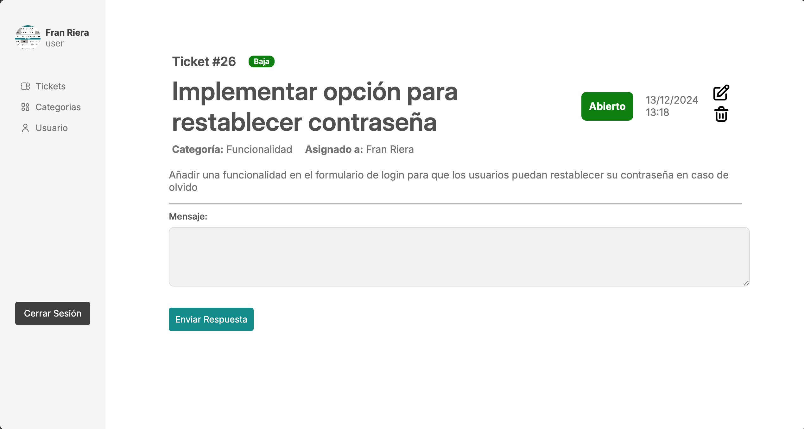

# Helplify - Plataforma de Ticketing

Helplify es una plataforma de ticketing diseñada para la gestión eficiente de solicitudes de soporte. Los usuarios pueden crear tickets para reportar problemas, mientras que los administradores gestionan y responden a estos tickets.

## Capturas de Pantalla

A continuación, se muestran algunas capturas de pantalla de las principales funcionalidades de Helplify:

### Login

*Pantalla de inicio de sesión para usuarios registrados.*

### Panel Principal

*Vista del panel principal donde los usuarios pueden visualizar y gestionar sus tickets.*

### Crear un Ticket

*Formulario para crear un nuevo ticket con la descripción del problema.*

### Detalle del Ticket

*Vista detallada de un ticket, donde se muestran comentarios y estado actual.*

## Tecnologías Utilizadas

- **PHP**: Lenguaje de programación utilizado en el backend.
- **HTML/CSS**: Estructura y diseño del sitio web.
- **JavaScript**: Funcionalidades interactivas y dinámicas.
- **MySQL**: Base de datos para el almacenamiento de tickets y usuarios.
